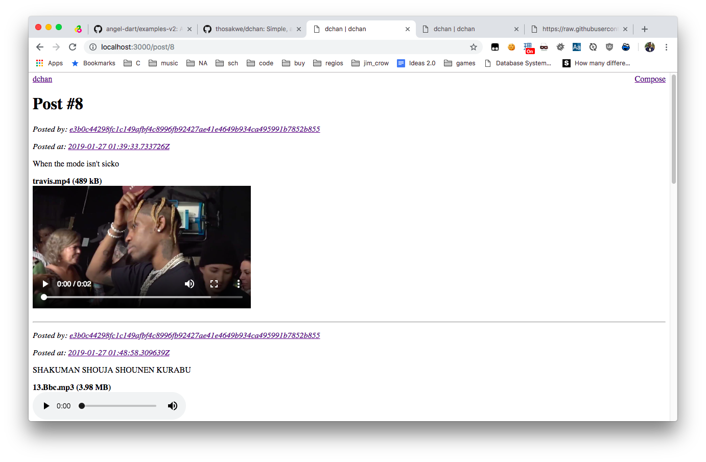

# dchan

A simple, anonymous text/multimedia board build in Angel3

Supports:

* Markdown
* Uploads
* Audio/video playback
* Image embedding
* User hashes instead of username/password

## Setup & Usage

You need Dart and PostgreSQL installed.

1. Run `psql -c "CREATE DATABASE dchan"`.
2. Run `dart bin/migrate.dart up`.
3. Run `dart.bin/prod.dart` to start the server.

Visit <http://localhost:3000>
